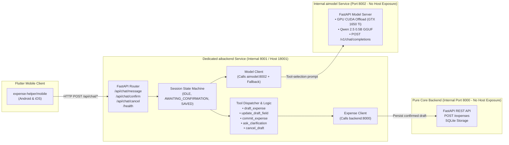

# AI Backend Orchestration Service (`aibackend`) 🤖🧠

`aibackend` is a dedicated microservice container running on internal port `8001` (published to host port `18001`) that acts as the **Agentic Orchestrator & Tool Caller**. It handles all application logic, conversation state machines, Python function calling / tool execution, and HTTP communications with both the pure model server (`aimodel:8002`) and the core expense database (`backend:8000`).

---

## 1. System Architecture



---

## 2. Key Responsibilities

1. **Python Logic & Function Calling**:
   - Maintains the formal JSON tool schemas (`TOOLS_SCHEMA`).
   - Dispatches tool invocations and normalizes dates (e.g. converting `"today"` or `"yesterday"` to ISO `YYYY-MM-DD`).
2. **Session State Management**:
   - Manages drafts in multi-turn conversation (`awaiting_confirmation`, `saved`, `cancelled`).
   - Supports natural language updates to draft fields (e.g. *"change amount to 50"*, *"change category to Food"*).
3. **HTTP Client (Curl & Httpx)**:
   - Queries `aimodel:8002/v1/chat/completions` for tool-selection decisions with graceful fallback to heuristic selection.
   - Pushes confirmed drafts to `backend:8000/expenses`.
4. **Resilience**:
   - If `aimodel` is temporarily busy or unreachable, `aibackend` automatically falls back to intelligent regex and keyword heuristics so the chat app never freezes.

---

## 3. Registered Tools

| Tool | Parameters | Description |
| :--- | :--- | :--- |
| **`draft_expense`** | `description`, `amount`, `category`, `date` | Creates a validated draft and prompts user for confirmation. |
| **`update_draft_field`** | `field`, `value` | Modifies an existing pending draft field (`amount`, `category`, `date`, `description`). |
| **`commit_expense`** | `description`, `amount`, `category`, `date` | Sends HTTP POST to `http://backend:8000/expenses` to persist in DB. |
| **`ask_clarification`** | `missing_field`, `question` | Prompts user when information is missing or ambiguous. |
| **`cancel_draft`** | `reason` | Discards the active draft and resets session state. |

---

## 4. Endpoints

- `POST /api/chat/message`: Send user message, returns assistant response and active draft card.
- `POST /api/chat/confirm`: Confirm and persist pending draft into core database.
- `POST /api/chat/cancel`: Discard pending draft.
- `POST /api/chat/reset`: Reset conversation session.
- `GET /health`: Health status reporting connectivity to both `aimodel` (port 8002) and `backend` (port 8000).

---

## 5. Local Setup & Testing

```bash
cd aibackend
pip install -r requirements.txt
pytest tests/ -v
uvicorn app.main:app --port 8001 --reload
```
