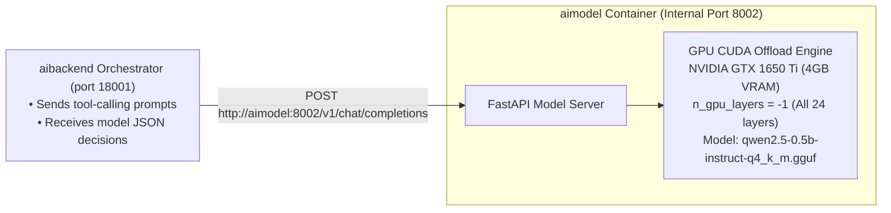

# AI Model Server Microservice (`aimodel`) 🤖⚡

`aimodel` is an internal microservice container running on port `8002` that provides **GPU-accelerated LLM Inference** using `llama-cpp-python` and `Qwen2.5-0.5B-Instruct-GGUF`. It runs the model on the GPU (NVIDIA GeForce GTX 1650 Ti) and exposes OpenAI-compatible and text generation APIs.

> [!NOTE]
> **No Unnecessary Port Exposure**: `aimodel` is an internal backend microservice consumed solely by `aibackend`. To keep host ports clean and avoid unnecessary exposure, `aimodel` is connected via the internal Docker bridge network (`expense-network:8002`) and is not exposed to host ports.

---

## 1. System Role



---

## 2. GPU Acceleration & Model Configuration

- **Target GPU**: NVIDIA GeForce GTX 1650 Ti (4096 MiB VRAM)
- **Model**: `qwen2.5-0.5b-instruct-q4_k_m.gguf` (~397 MB / 469 MB uncompressed)
- **VRAM Required**: ~450–600 MB (fits safely inside 4 GB VRAM)
- **Offload Parameter**: `N_GPU_LAYERS=-1` (all 24 transformer layers offloaded to GPU via CUDA)
- **Internal Port**: `8002` (within `expense-network`)
- **Device Status**: Reported in `GET /health`:
  ```json
  {
    "status": "healthy",
    "model_file_exists": true,
    "model_loaded": true,
    "model_path": "/app/models/qwen2.5-0.5b-instruct-q4_k_m.gguf",
    "device": "GPU CUDA Offload (n_gpu_layers=-1)"
  }
  ```

### Download Command
```bash
mkdir -p aimodel/models
curl -L \
  "https://huggingface.co/Qwen/Qwen2.5-0.5B-Instruct-GGUF/resolve/main/qwen2.5-0.5b-instruct-q4_k_m.gguf" \
  -o aimodel/models/qwen2.5-0.5b-instruct-q4_k_m.gguf
```

---

## 3. Endpoints (Internal Network)

- `GET /`: Service metadata, device info, and endpoints catalog.
- `GET /health`: Health status, model loaded flag, and GPU device info.
- `POST /v1/chat/completions`: OpenAI-compatible chat completion endpoint supporting `messages`, `temperature`, `max_tokens`, and `response_format={"type": "json_object"}`.
- `POST /generate`: Raw text completion endpoint taking `{ "prompt": "...", "temperature": 0.1, "max_tokens": 256 }`.

---

## 4. Running with Docker Compose

```bash
# Start aimodel container
docker-compose up -d aimodel

# View aimodel logs
docker-compose logs -f aimodel
```

---

## 5. Testing

```bash
cd aimodel
pytest tests/ -v
```
All 4 tests verify `/health`, `/v1/chat/completions`, and `/generate` endpoints.
